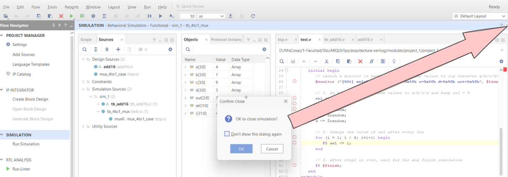

### 🧩 **Datos técnicos de la Basys 3**

* **Familia:** Artix-7
* **Dispositivo (FPGA):** `XC7A35T`
* **Package:** `CPG236`
* **Velocidad (Speed Grade):** `-1`

---

### ⚙️ **Configuración paso a paso en Vivado**

1. **Nuevo Proyecto → New Project Wizard**

   * Nombre: `Basys3_Project` (por ejemplo)
   * Tipo: **RTL Project**

2. **Default Part**

    En la pestaña **Parts** y seleccioná:

    | Campo       | Valor           |
    | ----------- | --------------- |
    | **Family**  | Artix-7         |
    | **Package** | CPG236          |
    | **Speed**   | -1              |
    | **Part**    | xc7a35tcpg236-1 |

---

### 💡 Consejo

Si no ves la placa **Basys 3** en la lista de *Boards*, necesitás instalar los archivos de soporte de Digilent.

Podés hacerlo así:

1. Descargá el archivo desde
   🔗 [https://digilent.com/reference/programmable-logic/vivado-board-files](https://digilent.com/reference/programmable-logic/vivado-board-files)
2. Extraé el contenido en la carpeta:

   ```
   C:\Xilinx\Vivado\<version>\data\boards\board_files\
   ```
3. Reiniciá Vivado y la Basys 3 aparecerá en la lista.

---

### Algunas anotaciones
- Un proyecto se organiza de manera jerárquica, similar a un programa de software con múltiples funciones. Un módulo principal, llamado módulo top, instancia y conecta otros módulos más pequeños (submódulos). Esta estructura permite un diseño modular, organizado y reutilizable.

- Un proyecto puede tener varios testbenches, uno para cada módulo que quieras probar. Puedes cambiar cuál es el testbench top de la simulación en cualquier momento.

- Un proyecto solo puede tener un módulo top para la síntesis en un momento dado, ya que el diseño final para el FPGA es un solo circuito

### Troubleshooting
```
boost::filesystem::remove: El proceso no tiene acceso al archivo porque está siendo utilizado por otro proceso: "D:/MisCosas/1-Facultad/5to/ARQUI/ tps/arquitectura-verilog/modules/project_1/project_1.sim/sim_1/behav/xsim/ simulate.log
```

<div style="text-align: center;">
  
</div>

---

```
ERROR: [Common 17-39] 'launch_simulation' failed due to earlier errors. 


ERROR: [USF-XSim-62] 'elaborate' step failed with error(s). Please check the Tcl console output or '...elaborate.log' file for more information.

```
Puede ser inconsistencia en la conexión de puertos.

Para mas informacion ver `elaborate.log`

---

### Referencias

- [HDLBits — Verilog Practice](https://hdlbits.01xz.net/wiki/Main_Page)

- [Basys 3 AMD Artix™ 7 FPGA Trainer Board: Recommended for Introductory Users](https://digilent.com/shop/basys-3-amd-artix-7-fpga-trainer-board-recommended-for-introductory-users/)