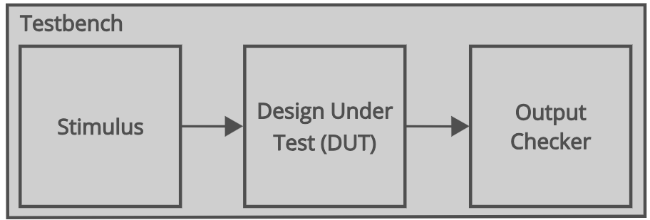
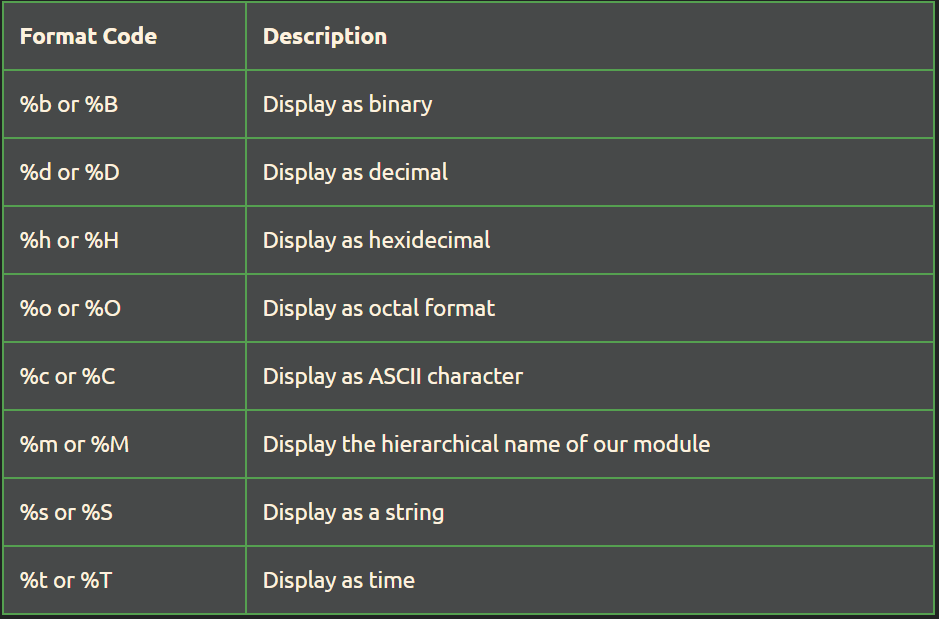

# 🧪 How to Write a Basic Verilog Testbench
## Architecture of a Basic Testbench

Un Testbench es un código Verilog no sintetizable que se utiliza para verificar el funcionamiento de un diseño de hardware.

El diagrama a continuación muestra la arquitectura típica de un Testbench simple.

<div style="text-align: center;">
  
</div>

El bloque de estímulo genera las entradas para nuestro diseño de FPGA y el verificador de salidas las prueba para garantizar que tengan los valores correctos.

El verificador de estímulos y de salidas se almacenará en archivos separados para diseños más grandes. También es posible incluir todos estos elementos en un solo archivo.

El fragmento de código a continuación muestra la sintaxis de un módulo vacío que podemos usar como nuestro testbench.

```verilog
module <module_name> ();
 // Our testbench code goes here
endmodule : <module_name>
```

**Consideraciones**
- La definicion de retardos tambien se puede hacer:
  ```verilog
  // A is set to 1 after 10 time units
  #10 a = 1'b1;
  ```

- Timescale Compiler Directive

  ```verilog
  `timescale <unit_time> / <resolution>
  ```

  Usamos el campo <unit_time> para especificar la unidad de tiempo principal de nuestro testbench y el campo <resolution> para definir la resolución de las unidades de tiempo en nuestra simulación.

  El campo <resolution> es importante, ya que podemos usar números no enteros para especificar el retardo en nuestro código Verilog. Por ejemplo, si queremos un retardo de 10,5 ns, podríamos simplemente escribir #10,5 como retardo.

  Por lo tanto, el campo <resolution> en la directiva del compilador determina el paso de tiempo mínimo que podemos modelar en nuestro código Verilog.

  Ambos campos en esta directiva del compilador toman un tipo de tiempo como 1 ps o 1 ns.
- **Verilog initial block**
  Es un bloque procedural como always. Pero a diferencia, este codigo no es sintetizable, es solo para propositos de testing.

  Cualquier código que escribamos dentro de un bloque inicial se ejecuta una vez, y sólo una vez, al comienzo de una simulación. Si hay mas de un bloque initial, estos se ejecutan en paralelo al inicio de la simulacion.

  ```verilog
  initial begin
  // Our code goes here
  end
  ```

  ejemplo

  ```verilog
  initial begin
    // Generate each input to an AND gate
    // Waiting 10 time units between each
    and_in = 2b'00;
    #10
    and_in = 2b'01;
    #10
    and_in = 2b'10;
    #10
    and_in = 2b'11;
  end
  ```

- **Verilog forever loop**
  Es un tipo importante de bucle que podemos utilizar en un testbench. Cuando lo usamos estamos creando un loop infinito, lo usamos para generar una señal de clock en nuestros testbenchs. Es importante tener en cuenta que cualquier bucle que escribamos debe estar contenido dentro de un procedural block or generate block.

  ```verilog
  initial begin
    clk = 1'b0;
    forever begin
      #1 clk = ~clk;
    end
  end
  ```

### 1\. **Objetivos de un Buen Test**

  * **Cobertura de Códigos:** Probar cada línea de código Verilog.
  * **Cobertura de Condiciones:** Probar cada posible condición lógica (ej: *Cout* es 0 y *Cout* es 1).
  * **Casos Límite (Corner Cases):** Probar valores extremos (cero, máximo, valores $x$, etc.).

### 2\. **Metodología Básica de Pruebas**

| Paso | Descripción | Referencia en tu TB |
| :--- | :--- | :--- |
| **Inicialización** | Asigna un valor inicial conocido a todas las señales de entrada (`reg`). **Nunca** las dejes en `x` (desconocido). | `tb_a = 16'd0;` |
| **Generación de Estímulos** | Aplica los valores de entrada (`tb_a`, `tb_b`, `tb_cin`) y usa el comando `#tiempo` para que el simulador avance. | `tb_a = 16'd10; #10;` |
| **Monitoreo/Visualización** | Observa las salidas (`tb_sum`, `tb_cout`). Esto puede ser pasivo (`$monitor`) o activo (`$display`). | `$monitor(...)` |
| **Comprobación (Self-Checking)**| **(Avanzado)** En lugar de solo mirar el `log`, usa comandos `$display` y `$assert` para que el TB verifique automáticamente si la salida es la correcta. | Ver `$display` y `$assert` abajo. |

-----

## 🔑 Palabras Reservadas Esenciales para Tests

Estas palabras son fundamentales para crear Testbenches más complejos y robustos.

| Palabra/Comando | Tipo | Descripción | Ejemplo de Uso |
| :--- | :--- | :--- | :--- |
| **`initial`** | Bloque | Ejecuta el código **solo una vez** al inicio de la simulación. Ideal para generar secuencias de prueba. | `initial begin ... end` |
| **`always`** | Bloque | Ejecuta el código **repetidamente** cuando ocurre un evento (ej: un flanco de reloj). Esencial para generar un *clock*. | `always #5 clk = ~clk;` |
| **`#tiempo`** | Retraso | Introduce un retraso en unidades de tiempo. La unidad se define con \`\`timescale` . |  `tb\_a = 1; \#5; tb\_a = 0;\` |
| **\`$monitor`** | Sistema | Muestra los valores de las señales cada vez que una de ellas cambia. (Útil para logs). | `$monitor ("%t: %h", $time, tb_sum);` |
| **`$display\`** | Sistema | Muestra valores de variables **una sola vez** donde es llamado. Útil para mensajes o comprobaciones. | \`$display ("Prueba Fallida en %t", $time);` |
| **`$finish\`\*\* | Sistema | Detiene y finaliza la simulación. | \`\#5 $finish;` |
| **`$time\`\*\* | Sistema | Devuelve el tiempo actual de la simulación. | \`value\_at\_time = $time;\` |

### `$display`

<div style="text-align: center;">
  
</div>

### Ejemplo completo
```verilog
`timescale 1ns / 1ps
module example_tb ();
  // Clock and reset signals
  reg clk;
  reg reset;
  // Design Inputs and outputs
  reg in_a;
  reg in_b;
  wire out_q;
  // DUT instantiation
  example_design dut (
    .clock (clk),
    .reset (reset),
    .a     (in_a),
    .b     (in_b),
    .q     (out_q)
  );
  // generate the clock
  initial begin
    clk = 1'b0;
    forever #1 clk = ~clk;
  end
  // Generate the reset
  initial begin
   reset = 1'b1;
    #10
   reset = 1'b0;
  end
  // Test stimulus
  initial begin
    // Use the monitor task to display the FPGA IO
    $monitor("time=%3d, in_a=%b, in_b=%b, q=%2b \n", 
              $time, in_a, in_b, q);
    // Generate each input with a 20 ns delay between them
    in_a = 1'b0;
    in_b = 1'b0;
    #20 
    in_a = 1'b1;
    #20
    in_a = 1'b0;
    in_b = 1'b1;
    #20 
    in_a = 1'b1;
  end
endmodule : example_tb 
end
```

## Referencia

[How to Write a Basic Verilog Testbench](https://fpgatutorial.com/how-to-write-a-basic-verilog-testbench/)