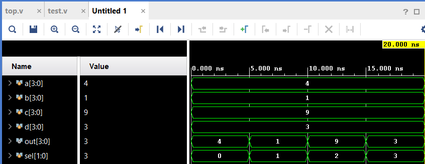

# Modulos
## Concepto general
Un module en Verilog representa un circuito con input y output ports que permiten su interacción con el exterior. Los sistemas más complejos se construyen combinando módulos más pequeños junto con elementos como assign statements y always blocks, formando una jerarquía donde un módulo puede contener instancias de otros.

Para crear un circuito jerárquico, se instancia un módulo dentro de otro, siempre que todos los módulos pertenezcan al mismo proyecto. El código de un módulo no se escribe dentro de otro, sino que se declara por separado.

**El fragmento de código a continuación muestra cómo se instancia un modulo.**

```
<module_name> # (
  // If the module uses parameters they are connected here
  .<parameter_name> (<parameter_value>)
)
<instance_name> (
  // Connection to the module ports
  .<port_name> (<signal_name>), 
  .<port_name> (signal_name>)
);
```

**El fragmento de código a continuación muestra la sintaxis general para la declaración de un módulo en verilog.**

```verilog
module (
  // We can optionally declare parameters here
  parameter <parameter_name> = <default_value>
)
<module_name> (
  // All IO are defined here
  <direction> <data_type> <size> <port_name>
);
 // Functional RTL (or structural) code
endmodule
```

**Consideraciones**:

- Aunque podemos declarar varios módulos en un solo archivo, es una buena práctica tener un archivo correspondiente a cada módulo.

- Es recomendable mantener el mismo nombre del archivo y del módulo. Esto facilita la gestión de diseños grandes con muchos componentes.

- Los Parameters son una forma local de constante que podemos usar para configurar un módulo en verilog. Solo podemos asignarle un valor al parámetro cuando se instancia el modulo.
  Ejemplo
  ```
  module counter #(
    parameter BITS = 8;
  )
  (
    input wire clock,
    input wire reset,
    output reg [BITS-1 : 0] count
  );
  ```
  instanciacion
  ```
  module top_level (
    input clock,
    input reset,
    output reg [7:0] count_8,
    output reg [11:0] count_12
  );
    // Instantiation of the 8 bit counter
    // In this instance we can use the default
    // value fo the parameter
    counter 8bit_count (
      .clock (clock),
      .reset (reset),
      .count (count_8)
    );
    // Instantiation of the 12 bit counter
    // In this instance we must override the 
    // value fo the WIDTH parameter
    counter #(.WIDTH (12)) 12_bit_count (
      .clock (clock),
      .reset (reset),
      .count (count_12)
    );
  endmodule
  ```


## Formas principales de conectar señales a los puertos de un módulo:

<div style="text-align: center;">
  
</div>

**By position:** 

los wires se conectan en el mismo orden en que fueron declarados los puertos del módulo.
Ejemplo:

```verilog
mod_a instance1 (wa, wb, wc);
```

Aquí wa se conecta a in1, wb a in2 y wc a out. El inconveniente es que si el orden o número de puertos cambia, todas las instancias deben modificarse.

**By name:** 

se conectan las señales usando el nombre del puerto, lo que hace el código más legible y resistente a cambios.

```verilog
mod_a instance2 (.out(wc), .in1(wa), .in2(wb));
```

En este caso, el orden no importa, ya que la conexión se realiza por nombre.

### Ejercicios

**1**

<div style="text-align: center;">
  
</div>

```verilog
module top_module ( input a, input b, input c, input d, output out1, output out2);
    mod_a instance1 (out1,out2,a,b,c,d);
endmodule
```

**2**

<div style="text-align: center;">
  
</div>


```verilog
module top_module ( input a, input b, input c, input d, output out1, output out2);
    mod_a instance_name ( .out1(out1), .out2(out2), .in1(a), .in2(b), .in3(c), .in4(d));
endmodule
```

**3 Module shift**

You are given a module my_dff with two inputs and one output (that implements a D flip-flop). Instantiate three of them, then chain them together to make a shift register of length 3. The clk port needs to be connected to all instances.

`The module provided to you is: module my_dff ( input clk, input d, output q );`

Note that to make the internal connections, you will need to declare some wires. Be careful about naming your wires and module instances: the names must be unique.

<div style="text-align: center;">
  
</div>

```verilog
module top_module ( input clk, input d, output q );
  
  	wire q1;
    wire q2;
    
    my_dff instance1 (.clk(clk), .d(d), .q(q1));
    my_dff instance2 (.clk(clk), .d(q1), .q(q2));
    my_dff instance3 (.clk(clk), .d(q2), .q(q));

endmodule
```

## El Bloque always

<div style="text-align: center;">
  
</div>

```verilog
module top_module ( input clk, input [7:0] d, input [1:0] sel, output [7:0] q );
  
    wire [7:0] q1;
    wire [7:0] q2;
    wire [7:0] q3;
    
	  my_dff8 inst1 (  .clk(clk), .d(d), .q(q1) );
	  my_dff8 inst2 (  .clk(clk), .d(q1), .q(q2) );
	  my_dff8 inst3 (  .clk(clk), .d(q2), .q(q3) );

    // Multiplexor (Lógica Combinacional)
    // Usamos 'always @(*)' para incluir automáticamente todas las entradas.
    always @(*) begin
      case (sel)
         2'b00 : q <= d;
         2'b01 : q <= q1;
         2'b10 : q <= q2;
         2'b11 : q <= q3;
      endcase
    end
endmodule
```

**Verilog** describe la **estructura y el comportamiento** de un hardware que funciona de forma **paralela**.

El bloque `always` es una de las construcciones procedimentales fundamentales en Verilog, que se utiliza para describir el comportamiento de un circuito. Lo que hay dentro de un bloque `always` se ejecuta cuando se produce un cambio en cualquiera de las señales listadas en su **lista de sensibilidad** (la parte entre paréntesis `@(...)`).

Existen dos usos principales para los bloques `always`, que describen dos tipos fundamentales de lógica de hardware:

### 1\. Lógica Combinacional (Cables y Compuertas)

  * **Propósito:** Describir circuitos cuya salida depende **únicamente** de las entradas actuales, como multiplexores, decodificadores, sumadores, etc.
  * **Lista de Sensibilidad:** Debe incluir **todas** las señales de entrada utilizadas dentro del bloque. Para simplificar, en Verilog moderno (IEEE 1364-2001 y posteriores) se utiliza `always @(*)`  para indicar que debe ser sensible a cualquier cambio en cualquiera de las entradas del bloque.
  * **Asignación:** Se recomienda usar la asignación **no bloqueante** (`=`) para evitar ambigüedades en la simulación.
  * **Ejemplo (Tu Multiplexor):**
    ```verilog
    always @(*) begin // Se usa @(*) en lugar de @(d or q1 or q2 or q3 or sel)
        case (sel)
            // ... las asignaciones ...
        endcase
    end
    ```

### 2\. Lógica Secuencial (Flip-Flops y Registros)

  * **Propósito:** Describir circuitos con memoria, cuya salida depende de las entradas actuales **y** del estado anterior, como flip-flops, registros y contadores.
  * **Lista de Sensibilidad:** Debe incluir solo el **reloj** (`clk`) y, si existe, la señal de **reset** (`reset`). Se usa `posedge clk` (flanco de subida) o `negedge clk` (flanco de bajada) para indicar el borde del reloj en el que debe ocurrir el cambio de estado.
  * **Asignación:** Se debe usar la asignación **no bloqueante** (`<=`)  para modelar correctamente el comportamiento de los flip-flops.
  * **Ejemplo (Un Flip-Flop Simple):**
    ```verilog
    always @(posedge clk) begin
        q_reg <= d_in; // Solo se actualiza en el flanco de subida del reloj
    end
    ```

-----

### Tipo de asignación

| Característica | Asignación **Bloqueante** (`=`) | Asignación **No Bloqueante** (`<=`) |
| :--- | :--- | :--- |
| **Lógica de Hardware** | **Combinacional** (Compuestas, Multiplexores, Sumadores, etc.) | **Secuencial** (Flip-Flops, Registros, Contadores) |
| **Inferencia** | El sintetizador crea **caminos de datos** o **cables** sin elementos de memoria. | El sintetizador crea **elementos de memoria** (Flip-Flops o Latches). |
| **Bloque `always`** | Se usa en bloques **no sincronizados** (p.ej., `always @(*)` o `always_comb`). | Se usa en bloques **sincronizados** al reloj (p.ej., `always @(posedge clk)` o `always_ff`). |
| **Diagrama Lógico** | Muestra **Compuertas** y **Wires** directos. | Muestra **Flip-Flops** o **Registros** con un *reloj* conectado. |


La asignación se llama **bloqueante** porque **bloquea** la ejecución de las siguientes sentencias dentro del mismo bloque `always` hasta que la asignación actual se completa **inmediatamente**. Este comportamiento secuencial en la simulación es el que, paradójicamente, modela el circuito **combinacional** del hardware.

#### 1\. Lógica Combinacional (Asignación Bloqueante `=`)

Cuando usas la asignación **bloqueante** (`=`) dentro de un `always @(*)` (como en el multiplexor de tu ejercicio), el sintetizador infiere **lógica combinacional**, donde la salida `q` es una función directa e **instantánea** de sus entradas.

* **Comportamiento de la Simulación Bloqueante:** Cuando el simulador encuentra una asignación bloqueante (`=`), la realiza y la salida se **actualiza inmediatamente**. La ejecución pasa a la siguiente línea **solo después** de que la variable de la línea actual haya tomado su nuevo valor.

    **Ejemplo de Bloqueante (`=`):**

    ```verilog
    always @(*) begin
        // La simulación ejecuta esto secuencialmente:
        temp = a + b;  // (1) temp recibe el nuevo valor de 'a + b' INMEDIATAMENTE.
        q = temp * 2;  // (2) 'q' se calcula usando el NUEVO valor de 'temp'.
    end
    ```

    Esto modela correctamente la propagación de una señal a través de dos niveles de lógica combinacional. El sintetizador **sintetizará dos bloques combinacionales conectados por un cable (wire)**.

#### 2\. Lógica Secuencial (Asignación No Bloqueante `<=`)

Cuando usas la asignación **no bloqueante** (`<=`) dentro de un `always @(posedge clk)`, el sintetizador infiere **lógica secuencial**. Se infiere un **Flip-Flop** o **Registro**.

```verilog
// Típico D-Flip-Flop interno de my_dff8:
always @(posedge clk) begin
    q_out <= d_in; // Asignación NO BLOQUEANTE (Lógica Secuencial/Registro)
end
```

* **Comportamiento de la Simulación No Bloqueante:** Se utiliza para modelar la lógica **secuencial** (Flip-Flops). En este caso, el valor de la derecha (RHS) se evalúa inmediatamente, pero la asignación al valor de la izquierda (LHS) se **pospone** hasta el final del paso de tiempo de la simulación. Ninguna sentencia posterior dentro del mismo bloque ve el nuevo valor asignado en ese paso de tiempo.

  * Esto simula que el Flip-Flop captura la entrada en el flanco del reloj y su salida (`q`) **no cambia** hasta un instante después.

    **Ejemplo de No Bloqueante (`<=`):**

    ```verilog
    always @(posedge clk) begin
        // La simulación evalúa ambos RHS's ANTES de actualizar cualquier LHS.
        q1 <= d_in;  // (1) Evalúa d_in. q1 NO se actualiza aún.
        q2 <= q1;    // (2) Evalúa q1 usando su valor ANTIGUO.
    end
    ```

    El resultado es que `q2` toma el valor de `d_in` un ciclo de reloj *después* de que `q1` lo haya tomado, modelando correctamente un **registro de desplazamiento**.

En resumen, la asignación **bloqueante** se llama así porque fuerza la simulación a un orden secuencial (bloqueando la siguiente línea hasta que se completa la actual), lo cual resulta ser la forma correcta de describir la propagación instantánea de las señales en la **lógica combinacional**.

### Ejercicios

**1.** [Verilog 4 to 1 Multiplexer/Mux](https://www.chipverify.com/verilog/verilog-4to1-mux)


<div style="text-align: center;">
  
</div>

Log:

```verilog
# run 1000ns
[0] sel=0x0 a=0x4 b=0x1 c=0x9 d=0x3 out=0x4
[5000] sel=0x1 a=0x4 b=0x1 c=0x9 d=0x3 out=0x1
[10000] sel=0x2 a=0x4 b=0x1 c=0x9 d=0x3 out=0x9
[15000] sel=0x3 a=0x4 b=0x1 c=0x9 d=0x3 out=0x3
```

Run linter > Open elaborated design:

<div style="text-align: center;">
  
</div>

## Referencias

[How to Write a Basic Verilog Module](https://fpgatutorial.com/how-to-write-a-basic-verilog-module/)
