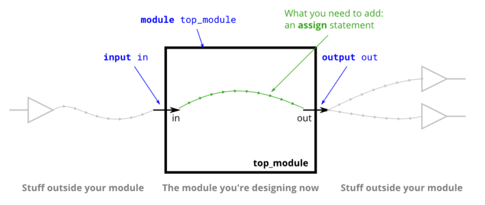
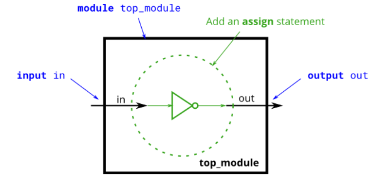
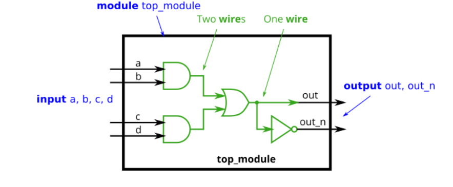
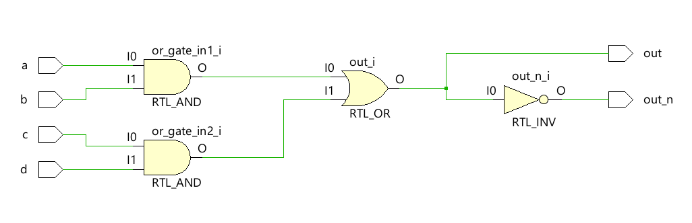

# Project1 - Basics
## Algunas operaciones Basicas
**Simple wire**
<div style="text-align: center;">
  
</div>

```verilog
module top_module( input in, output out );
	assign out = in;
endmodule
```
**NOT**
<div style="text-align: center;">
  
</div>

```verilog
module top_module( input in, output out );
	assign out =~ in;
endmodule
```
**AND**
```verilog
module top_module( input a, input b, output out );
	assign out = a & b;
endmodule
```
**NOR**
```verilog
module top_module( input a, input b, output out );
    assign out = ~(a | b);
endmodule
```
**XNOR**
```verilog
module top_module( input a, input b, output out );
	assign out = a ^~ b;
endmodule
```

## Declaring wires
<div style="text-align: center;">
  
</div>
<div style="text-align: center;">
  
</div>

```verilog
module top_module( input a, input b, input c, input d, output out, output out_n);
    
	wire or_gate_in1;
	wire or_gate_in2;
    
    assign or_gate_in1 = a & b;
    assign or_gate_in2 = c & d;
    
    assign out = or_gate_in1 | or_gate_in2;
    assign out_n = ~(or_gate_in1 | or_gate_in2);
endmodule
```

## Caracteristicas:

- Los cables (`wire`) son **unidireccionales**: la información va del origen (fuente o *driver*) hacia el destino (*sink*).

- La instrucción `assign` conecta señales de forma continua, es decir, la salida se actualiza automáticamente cuando cambia la entrada.

- Los `assign` sirven para conectar señales (no crean cables nuevos, solo las conexiones).

- Los puertos `input` y `output` ya implican la declaración de cables (`wire`), por lo tanto no hace falta declararlos de nuevo.

- El orden de los `assign` no importa, ya que describen conexiones y no acciones secuenciales.

- El `assign` recalcula continuamente la salida cada vez que cambian las entradas, como un circuito combinacional sin memoria.


- En circuitos más complejos, se necesitan cables internos para conectar componentes. Los `wire` deben declararse dentro del módulo antes de usarse.
