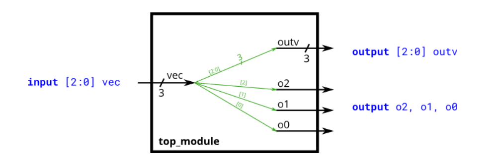
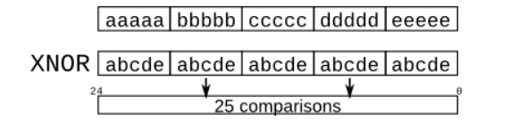
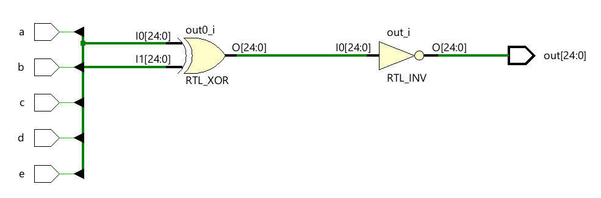

# Vectores
## Concepto general
Los vectores agrupan múltiples señales relacionadas bajo un solo nombre, lo que simplifica su manejo. El rango se coloca antes del nombre (a diferencia de C), y se accede a bits individuales o porciones del vector usando w[3:0], w[7], etc.

```verilog
wire [7:0] w;   // Vector de 8 bits, equivalente a 8 cables separados
```

<div style="text-align: center;">
  
</div>

**Ejemplo basico**

```verilog
wire [99:0] my_vector;
assign out = my_vector[10]; // Accede al bit 10
```


## Declaración de vectores

**Formato:**

```verilog
type [superior:inferior] nombre_vector;
```

**Ejemplos:**

```verilog
wire [7:0] w;        // 8 bits
reg  [4:1] x;        // 4 bits
output reg [0:0] y;  // 1 bit
input wire [3:-2] z; // 6 bits (rango negativo permitido)
wire [0:7] b;        // Big-endian: b[0] es el bit más significativo
```

* `[3:0]` → *little-endian* (bit 0 es el menos significativo)
* `[0:3]` → *big-endian*
  ⚠️ Una vez elegido el orden, debe mantenerse constante; mezclar direcciones produce errores.

## Nets implícitas **(Implicit nets)**

Si usas una señal sin declararla, Verilog crea **automáticamente un cable de 1 bit**, lo que puede generar errores si esperabas un vector.
Ejemplo:

```verilog
assign a = 3'b101;
assign b = a; // b se crea implícitamente con 1 bit → error potencial
```

Para evitarlo:

```verilog
default_nettype none
```

Esto desactiva la creación automática de cables.

---

## Arreglos empaquetados y desempaquetados

- **Empaquetados (packed)**: bits consecutivos en un solo vector (`reg [7:0] mem;`)
- **Desempaquetados (unpacked)**: múltiples vectores o memorias (`reg [7:0] mem [255:0];` → 256 palabras de 8 bits).
  Usados para representar memoria o bancos de registros.

---

## Selección de partes (Part-select)

Permite acceder a una parte del vector:

```verilog
w[3:0]    // 4 bits inferiores
x[1]      // 1 bit
z[-1:-2]  // 2 bits inferiores
```

El orden debe coincidir con la dirección del vector.
Si se asignan vectores de distinto tamaño, se rellenan con ceros o se truncan automáticamente.

---

## Cambio de endianess **(Byte swap)**

Un vector de 32 bits puede verse como 4 bytes:

```
AaaaaaaaBbbbbbbbCcccccccDddddddd
→ DdddddddCcccccccBbbbbbbbAaaaaaaa
```

Este intercambio de bytes se usa al convertir datos entre sistemas **little-endian** y **big-endian**.

---

## Operadores bit a bit vs. lógicos

- **Bitwise (`|`, `&`, `~`)** → opera bit por bit y produce un vector del mismo tamaño.
- **Logical (`||`, `&&`, `!`)** → trata el vector completo como un valor booleano (1 o 0).
  Ejemplo:

```verilog
assign out_bitwise = a | b;  // resultado de N bits
assign out_logic   = a || b; // resultado de 1 bit
```

Comprender esta diferencia es clave al usar vectores.

---

## Concatenación **(`{}`)**

Permite unir varios vectores o bits en uno mayor:

```verilog
{3'b111, 3'b000}     // 6'b111000
{1'b1, 1'b0, 3'b101} // 5'b10101
{4'ha, 4'd10}        // 8'b10101010
```

Todas las partes deben tener tamaño definido.
También puede usarse en el lado izquierdo de una asignación:

```verilog
assign {out[7:0], out[15:8]} = in;     // Intercambia bytes
assign out[15:0] = {in[7:0], in[15:8]};
assign out = {in[7:0], in[15:8]};      // Los bits sobrantes se llenan con ceros
```

## Operador de replicación **`{num{vector}}`**

Permite **repetir un vector varias veces** y concatenar los resultados, evitando tener que escribir manualmente algo como `{b,b,b,b}`.

Sintaxis:
```verilog
{num{vector}}
```

* `num` debe ser una **constante**.
* El resultado es un vector formado por `num` copias consecutivas de `vector`.

**Ejemplos**

```verilog
{5{1'b1}}         // 5'b11111
{2{a,b,c}}        // Igual a {a,b,c,a,b,c}
{3'd5, {2{3'd6}}} // 9'b101_110_110 los "_" indican que se ha concatenado 
```

## Aplicación común: extensión de signo

El operador se usa frecuentemente para **extender el signo** de un número binario al pasarlo a un tamaño mayor, preservando su valor (positivo o negativo).

Ejemplo:

* `4'b0101` → `8'b00000101` (valor positivo, relleno con ceros)
* `4'b1101` → `8'b11111101` (valor negativo, relleno con unos)

Para extender un número de 8 bits a 32 bits:

```verilog
assign out = { {24{in[7]}}, in };
```

→ Replica el bit más significativo (`in[7]`, el bit del signo) 24 veces y concatena el número original.

Resultado:
`{ 24 bits del signo repetido , los 8 bits originales }`

## Ejemplo avanzado: comparaciones por pares

Dadas cinco señales de 1 bit (`a`, `b`, `c`, `d`, `e`), se puede generar un vector de 25 bits con todas las comparaciones posibles entre ellas.
Cada bit del resultado vale `1` si los dos bits comparados son iguales (XOR).

Ejemplo sin usar comparacion ni replicacion:

```verilog
out[24] = ~a ^ a;   // siempre 1
out[23] = ~a ^ b;
...
out[0]  = ~e ^ e;   // siempre 1
```

<div style="text-align: center;">
  
</div>

Este circuito puede implementarse **de forma más compacta** usando **replicación y concatenación**, creando:

* un vector superior con **5 repeticiones de cada entrada**, y
* un vector inferior con **5 repeticiones del conjunto completo de entradas**.

```verilog
module top_module (
    input  a, b, c, d, e,
    output [24:0] out
);

    // Vector de entradas agrupadas
    wire [4:0] inputs = {a, b, c, d, e};

    // Vector superior: 5 repeticiones de cada entrada (25 bits)
    wire [24:0] top_vector = {5{inputs}};

    // Vector inferior: 5 repeticiones del conjunto completo de entradas (25 bits)
    wire [24:0] bottom_vector = {{5{a}}, {5{b}}, {5{c}}, {5{d}}, {5{e}}};

    // Comparación bit a bit: 1 si los bits son iguales, 0 si son distintos
    assign out = ~(top_vector ^ bottom_vector);

endmodule
```

<div style="text-align: center;">
  
</div>

**Explicación breve**

* `inputs = {a,b,c,d,e}` agrupa las señales en un solo vector de 5 bits.
* `{5{inputs}}` crea 5 copias consecutivas → **25 bits**.
* `{{5{a}}, {5{b}}, {5{c}}, {5{d}}, {5{e}}}` crea el otro vector, donde cada entrada se repite 5 veces.
* Finalmente, `~(top_vector ^ bottom_vector)` devuelve **1** en cada posición donde los bits son iguales (XOR invertido).
